# API Restfull

  - [Tecnologias Usadas](#Tecnologias-Usadas)
  - [Sobre](#Sobre)
  - [Inicio](#Inicio)
  - [Desenvolvendo a API](#Mapeando-a-API)
  - [Melhorias](#Melhoriais)

 
## Tecnologias Usadas

[Java](https://www.java.com/pt-BR/) / [Spring](https://spring.io/projects/spring-boot) / [Docker](https://www.docker.com/) / [PostgresSQL](https://www.postgresql.org/) / [Pgadmin4](https://www.pgadmin.org/download/pgadmin-4-windows/)
 / [Postman](https://www.postman.com/)

## Sobre 

Programa para exemplificar a construção de uma API Restful em um projeto já mapeado com JPA. Utilizando o Docker para rodar um banco de dados PostgreSQL em conjunto com console PgAdmin4, Aplicativo Postman foi utilizado para testar nossas requições HTTP da API.

O projeto trata de uma simulação de Autor e Livros, os dois objetos são tratados como tabelas em banco de dados.

## Inicio

No inicio do projeto eu clonei um projeto já pronto do meu [git hub](https://github.com/Hugoftf/Spring-DataJPA) sobre JPA, para implementar a camada de controller e service e desenvolver a API Restful.

Primeiro precisei adicionar a dependencia starter web no meu arquivo xml do programa para o gerenciador spring possa reconhecer as nossas aplicações da API.

Para começar a implementar a Api, primeiro criamos a classe AutorController no pacote controller, em seguida a classe AutorService no pacote service, AutorController é a classe que recebe a anotação @RestController (Quando você utiliza @RestController em uma classe, ela indica que a classe será um controlador (controller) responsável por responder a requisições HTTP e, além disso, os métodos dentro dessa classe retornam dados (normalmente em formato JSON ou XML) ao invés de uma página de visualização.), e também a anotação @RequestMapping (A anotação @RequestMapping no Spring Framework é usada para mapear requisições HTTP para métodos específicos de um controlador. Ela pode ser aplicada a uma classe ou a métodos individuais e permite que você defina como as requisições serão tratadas, especificando a URL, o tipo de requisição (GET, POST, PUT, DELETE etc.)), em seguida faremos uma injeção de dependencia da classe AutorService:

Por sua vez a classe AutorService recebe a anotação @Service (A camada Service em uma aplicação, especialmente em uma API, é responsável pela lógica de negócios. Ela atua como uma camada intermediária entre a camada de Controller (responsável pelas requisições HTTP) e a camada de Repository/DAO (responsável pela persistência de dados, como bancos de dados)), ela é reponsavel pela lógica, e passa para o controller tudo mastigado. A classe tem uma injeção de dependencia do AutorRepository para realizar as ações nos métodos.

## Mapeando a API

### DTO

Para começar criaremos o record AutorDTO, ele vai servi para simular alguns campos da classe Autor.

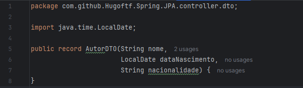

E criamos o método mapeandoParaAutor para transformar campos de AutorDTO em Autor, setando os campos obrigatórios de autor:

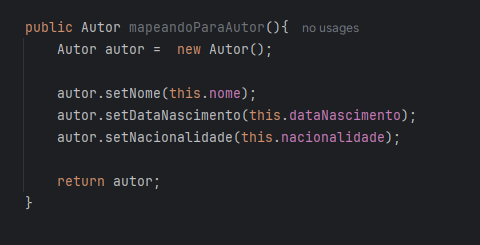

### Criando CRUD e Testando Estrutura do Programa

#### POST

Criando um metodo post básico na classe Controller para testar requisições e a estrutura do projeto:

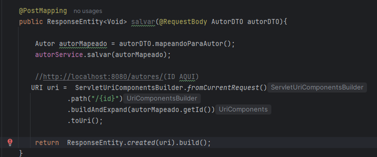

Na camada Service:

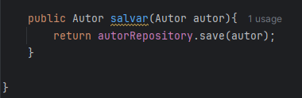

O retorno no Postman:

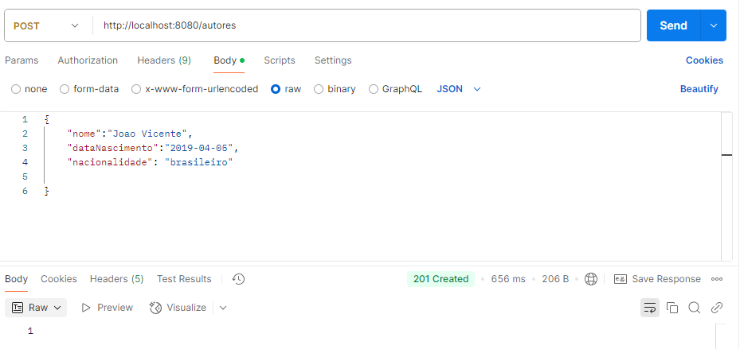

No Banco de Dados:

Como funciona o Post, no nosso Postman utilizamos a URL juntamente com a requicição POST, No nosso metodo, ele está anotado com @PostMapping, para que quando A requisição for POST junto com a url definida no parametro do método(Que geralmente o padrão e o mesmo da classe), ele execute as ações do método. No caso do nosso método POST, ele transita entre service e repository para salvar no banco de dados, o metodo recebe como parametro um AutorDTO que e convertido em Autor, e como o corpo do método é ResponseEntity para ter um retorno mais personalizado no Postman, ele necessita da URI para retorna no Postman.

#### GET

Agora com o método Get:

Na camada Service:

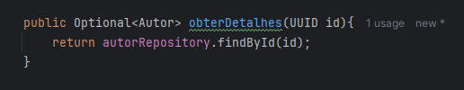

No Postman:

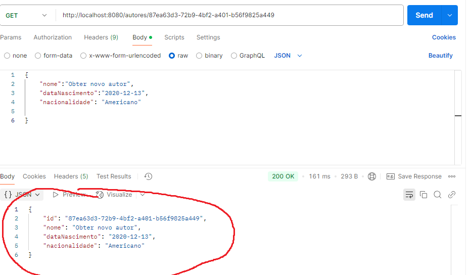

No caso do Get, na anotação GetMapping, necessita do parametro /id, o UUID do autor no banco de dados. Depois de realiar a Requisição Get juntamente com o http e id, ele retorna os dados do autor(ou não) e o código do ResponseEntity.

#### DELETE

Metodo delete, com a anotação DeleteMapping com o parametro /id:

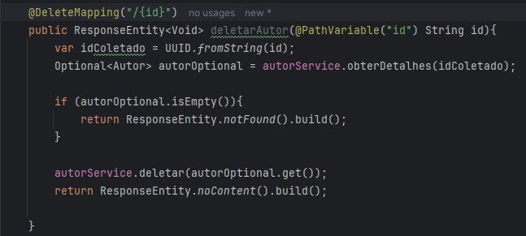

Na camada Service:

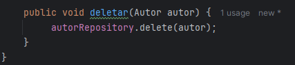

No Postman:

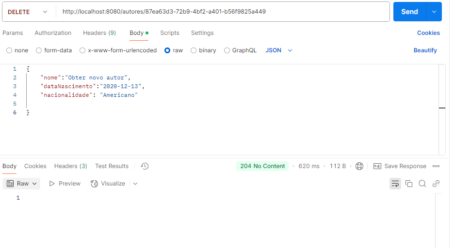

(Parecido com o metodo GET)

#### PUT

Metodo Put, recebe a anotação @PutMapping com parametro id da requisição:

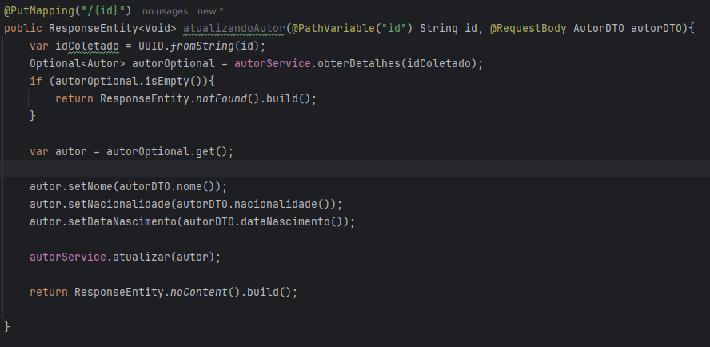

Na camada Service:

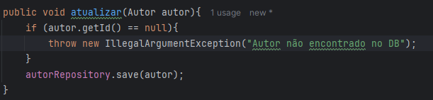

Ele é uma mistura de Get com Post, com o id da requisição ele busca no banco se o autor existe ou não, o outro parametro tem a anotação @RequestBody para receber o o Autor do banco, em seguida da um set nas novas informações que é posta no Postman em formato JSON.

No Postman:

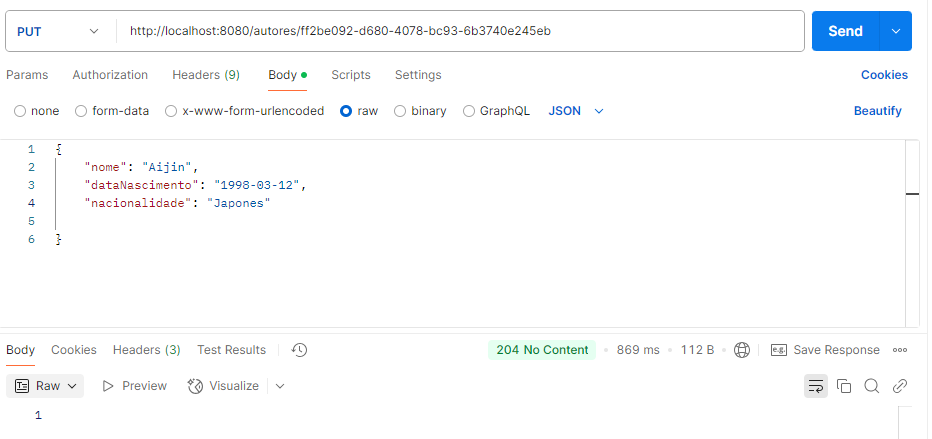

