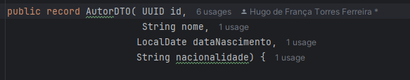

# API Restfull

  - [Tecnologias Usadas](#Tecnologias-Usadas)
  - [Sobre](#Sobre)
  - [Inicio](#Inicio)
  - [Desenvolvendo a API](#Mapeando-a-API)
  - [Melhorias](#Melhorias)

 
## Tecnologias Usadas

[Java](https://www.java.com/pt-BR/) / [Spring](https://spring.io/projects/spring-boot) / [Docker](https://www.docker.com/) / [PostgresSQL](https://www.postgresql.org/) / [Pgadmin4](https://www.pgadmin.org/download/pgadmin-4-windows/)
 / [Postman](https://www.postman.com/)

## Sobre 

Programa para exemplificar a construção de uma API Restful em um projeto já mapeado com JPA. Utilizando o Docker para rodar um banco de dados PostgreSQL em conjunto com console PgAdmin4, Aplicativo Postman foi utilizado para testar nossas requições HTTP da API.

O projeto trata de uma simulação de Autor e Livros, os dois objetos são tratados como tabelas em banco de dados.

## Inicio

No inicio do projeto eu clonei um projeto já pronto do meu [git hub](https://github.com/Hugoftf/Spring-DataJPA) sobre JPA, para implementar a camada de controller e service e desenvolver a API Restful.

Primeiro precisei adicionar a dependencia starter web no meu arquivo xml do programa para o gerenciador spring possa reconhecer as nossas aplicações da API.

Para começar a implementar a Api, primeiro criamos a classe AutorController no pacote controller, em seguida a classe AutorService no pacote service, AutorController é a classe que recebe a anotação @RestController (Quando você utiliza @RestController em uma classe, ela indica que a classe será um controlador (controller) responsável por responder a requisições HTTP e, além disso, os métodos dentro dessa classe retornam dados (normalmente em formato JSON ou XML) ao invés de uma página de visualização.), e também a anotação @RequestMapping (A anotação @RequestMapping no Spring Framework é usada para mapear requisições HTTP para métodos específicos de um controlador. Ela pode ser aplicada a uma classe ou a métodos individuais e permite que você defina como as requisições serão tratadas, especificando a URL, o tipo de requisição (GET, POST, PUT, DELETE etc.)), em seguida faremos uma injeção de dependencia da classe AutorService:

Por sua vez a classe AutorService recebe a anotação @Service (A camada Service em uma aplicação, especialmente em uma API, é responsável pela lógica de negócios. Ela atua como uma camada intermediária entre a camada de Controller (responsável pelas requisições HTTP) e a camada de Repository/DAO (responsável pela persistência de dados, como bancos de dados)), ela é reponsavel pela lógica, e passa para o controller tudo mastigado. A classe tem uma injeção de dependencia do AutorRepository para realizar as ações nos métodos.

## Mapeando a API

### DTO

Para começar criaremos o record AutorDTO, ele vai servi para simular alguns campos da classe Autor.

E criamos o método mapeandoParaAutor para transformar campos de AutorDTO em Autor, setando os campos obrigatórios de autor:

### Criando CRUD e Testando Estrutura do Programa

#### POST

Criando um metodo post básico na classe Controller para testar requisições e a estrutura do projeto:

Na camada Service:

O retorno no Postman:

No Banco de Dados:

Como funciona o Post, no nosso Postman utilizamos a URL juntamente com a requicição POST, No nosso metodo, ele está anotado com @PostMapping, para que quando A requisição for POST junto com a url definida no parametro do método(Que geralmente o padrão e o mesmo da classe), ele execute as ações do método. No caso do nosso método POST, ele transita entre service e repository para salvar no banco de dados, o metodo recebe como parametro um AutorDTO que e convertido em Autor, e como o corpo do método é ResponseEntity para ter um retorno mais personalizado no Postman, ele necessita da URI para retorna no Postman.

#### GET

Agora com o método Get:

Na camada Service:

No Postman:

No caso do Get, na anotação GetMapping, necessita do parametro /id, o UUID do autor no banco de dados. Depois de realiar a Requisição Get juntamente com o http e id, ele retorna os dados do autor(ou não) e o código do ResponseEntity.

#### DELETE

Metodo delete, com a anotação DeleteMapping com o parametro /id:

Na camada Service:

No Postman:

(Parecido com o metodo GET)

#### PUT

Metodo Put, recebe a anotação @PutMapping com parametro id da requisição:

Na camada Service:

Ele é uma mistura de Get com Post, com o id da requisição ele busca no banco se o autor existe ou não, o outro parametro tem a anotação @RequestBody para receber o o Autor do banco, em seguida da um set nas novas informações que é posta no Postman em formato JSON.

No Postman:

## Melhorias

### Melhorando a entidade Autor

Antes de começar a adicionar melhores na classe autor, no arquivo aplication.yml(yamal) vamos adicionar uma mudança de jpa, para que não precise dropar a tabela no banco de dados e implementar mudanças no prório programa atraves de java e jpa:

Feito a mudança, na classe Autor foi implementado as colunas: dataCadastro, dataAtualizacao e idUsuario:

O campo dataCadastro irá servi para que novos  Autores cadastrado no banco de dados tenha sua data e hora registrada nessa coluna;
O campo DataAutalizacao irá servi para quando o campo for atualizado será modificado a data e hora para cada respectiva atualização;

### AutorRepository

Adicionando QueryMethods personalizados para ser utilizados para consulta personalizadas e possiveis erros:

### Criação de Erros personalizados:

Para que o codigo fique mais limpos, iremos implementar soluções personalizadas para pósiveis erros;

O record ErroCampo vai servi para identificar em qual campo o erro aconteceu e com sua descriação

O record ErroResposta será a representação do corpo do erro, que não necessariamente possam ser com o campo, possui um campo com atributo int para representar o código de status,
a uma string para retornar que tipo de erro aconteceu e uma lista de ErroCampo para no caso de erro em campos da entidade. Ele possui 2 metodos statics para situações com que não sejam erros com campos então por isso qe retornar uma lista vazia

### Exceptions

Criando também exceptions personalizadas que herdam de Runtime, para deixar o código mais limpo.

A classe RegistroDuplicado vai servi para uma tratar um erro expecífico de duplicação de registro no banco de dados.

A classe OperacaoNaoPermitida, vai servi para tratar possuveis erros genéricos que possam acontecer:

### Criação de Validator

Criando uma classe chamada Validator para checar alguns condições antes de enviar as mdanças ao banco de dados, caso contrário irá lançar uma dos nossos erros ou exceções:

Metodos de validação com exceções personlizadas:

### Mudanças na camada Service

Implementando injeções de dependencias para a classe LivroRepository para possivel tratativa de erro:

Agora precisamos atualizar os metodos, colocar validações para deixar o código mais seguro.

#### Delete no Service

Primeiro vamos criar um metodo boolean para identificar se o autor possui livro. Por regra de negocios, você não pode excluir um autor se ele tiver um livro associado a ele:

Depois atualizamos o metodo com essa validação para então excluir o autor:

#### Salvar e Atualizar

Vamos atualizar também os metodos salvar e atualizar, onde precisamos validar antes de salvar se o existe o autor da mesma forma que precisamos validar se existe o autor antes de tentar atualizar, caso exista retornar a nossa exceção personalizada:

### Mudança em métodos na camada controller

Agora na camada controller vamos também atualizar nossos cruds.

#### POST

Como na camada service os nossos validador lança exceções personalizadas, os nossos metodos da camada controller serão tratados com o try-catch.

Repare que se o metodo lança exceção o retorno deverá ser um ResponseEntity, que tem a representação no record ErroResposta com o codigo de status http, a mensagem da exceção e talves os campos que possam ter causados erros. No postman para testar o metodo, erramos de proposito e o resultado é:

#### PUT

Da mesma forma, o put tem o mesmo tratamento que o post:

o retorno no postman:

#### DELETE

No metodo delete, utilizamos o metodo static conflito do record ErroStatus para dizer que não podemos deletar um autor que tenha livros associado:

O retorno no Postman:

