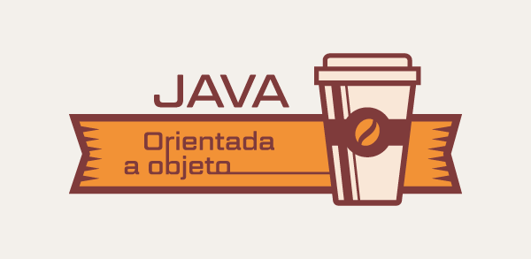

# API Restfull

  - [Tecnologias Usadas](#Tecnologias-Usadas)
  - [Sobre](#Sobre)
  - [Inicio](#Inicio)

 
## Tecnologias Usadas

[Java](https://www.java.com/pt-BR/) / [Spring](https://spring.io/projects/spring-boot) / [Docker](https://www.docker.com/) / [PostgresSQL](https://www.postgresql.org/) / [Pgadmin4](https://www.pgadmin.org/download/pgadmin-4-windows/)
 / [Postman](https://www.postman.com/)

## Sobre 

Programa para exemplificar a construção de uma API Rest full em um projeto já mapeado com JPA. Utilizando o Docker para rodar um banco de dados PostgreSQL em conjunto com console PgAdmin4, Aplicativo Postman foi utilizado para testar nossas requições HTTP da API.

## Inicio

No inicio do projeto eu clonei um projeto já pronto do meu [git hub](https://github.com/Hugoftf/Spring-DataJPA) sobre JPA, para implementar a camada de controller e service e desenvolver a API Restful.

Primeiro precisei adicionar a dependencia starter web no meu arquivo xml do programa para o gerenciador spring possa reconhecer as nossas aplicações da API.

